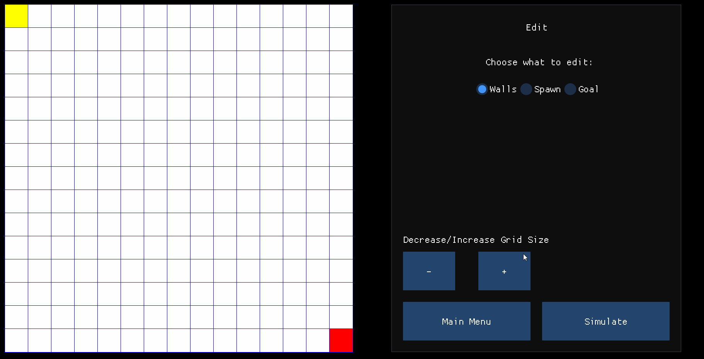

# Path-Visualisation

## Background
This project aims to allow visual understanding of some common search algorithms. The current project supports the Grid view. In the future, a Tree view will also be supported.

## Build Using Premake5
This project utilizes premake to build because of its simplicity. It is known to correctly build and run with Visual Studio 2022. It should "in theory" work with other targets such as GNU Makefiles. This project currently only supports Windows.

## Resources
[Dear ImGui](https://github.com/ocornut/imgui)  
[SFML](https://www.sfml-dev.org/)  
[Premake5](https://premake.github.io/)  
